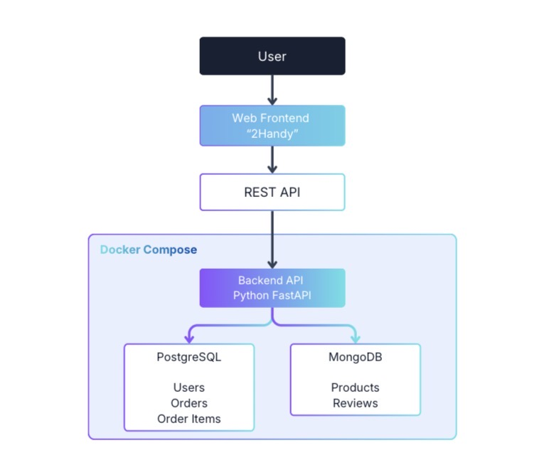

# 2Handy - Secondhand Marketplace API

This project is a Backend API for the "2Handy" secondhand marketplace platform, developed as part of Checkpoint 1 (CP1) for the course **269340: Data Centric Application Development**. The project implements a Dual-Database architecture to separate transactional data management from highly flexible data storage.

## 👥 Team Roster (the smachik gang)
* **1:** 670615108 Prempracha Numchai - PostgreSQL (Users + Orders)
* **2:** 670615036 Apiluk Bualuang - MongoDB (Products + Reviews)
* **3:** 670615031 Peeratchai Matunboon - REST API + Backend Integration
* **4:** 670615030 Pattanan Siriworakul - Docker + Seed Data + Documentation

---

## System Architecture



The system is designed with separated responsibilities within a Docker Compose environment[cite: 17]:
* **Web Frontend:** The "2Handy" user interface connecting via REST API[cite: 17].
* **Backend API:** Built with Python (FastAPI), serving as the core engine to process and route data[cite: 17].
* **PostgreSQL (Transactional Data):** A relational database managing core transactional domain data (`Users`, `Orders`, and `Order Items`)[cite: 1, 17].
* **MongoDB (Flexible Data):** A document store managing flexible, semi-structured data (`Products` and `Reviews`)[cite: 1, 17].

---

## ⚙️ Prerequisites
Before running the project, ensure you have the following installed on your machine:
* [Docker](https://www.docker.com/products/docker-desktop/) and Docker Compose
* [Python 3.9+](https://www.python.org/downloads/)
* Git

---

## 🚀 Setup Instructions

**1. Clone the repository**
```bash
git clone [https://github.com/pattanankm/2Handy.git](https://github.com/pattanankm/2Handy.git)
cd 2Handy